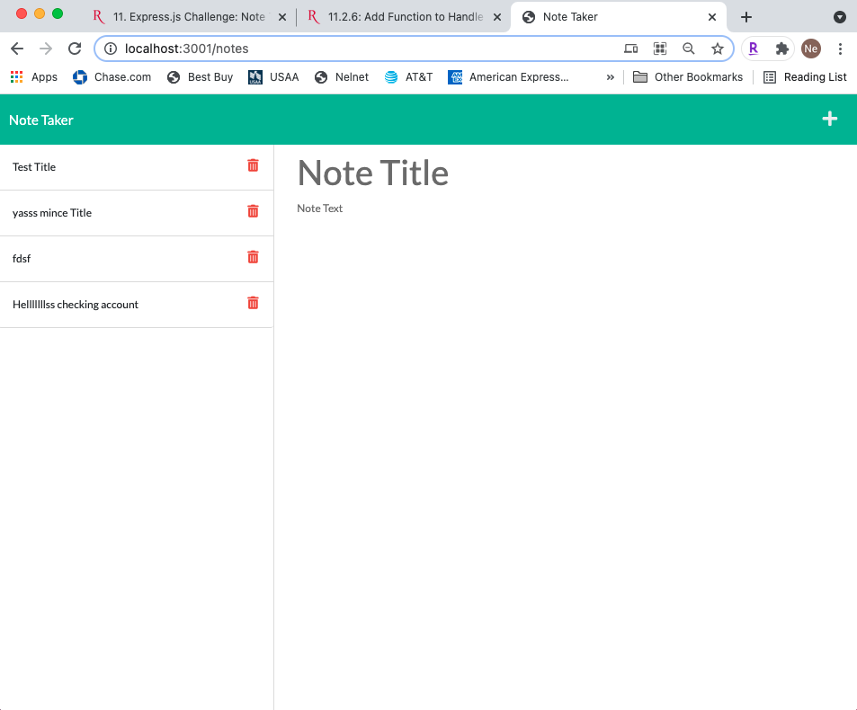

  # TakeThePenSamantha
  

  ## Description 
    * create an application called Note Taker that can be used to write and save notes. This application will use an Express.js back end and will save and retrieve note data from a JSON file.
  ## Table of Contents (Optional)
  
  * [Installation](#installation)
  * [Usage](#usage)
  * [Credits](#credits)
  * [License](#license)

  ## Installation
    * To install: No install required. Just use this link - https://boiling-citadel-36906.herokuapp.com/notes
  
  ## Usage 
    * Use this program by: use how you want
  
  
  
  
  ## Credits
   * The following folks helped with this project: Cris
  
  ## License
   * This project uses this license: https://opensource.org/licenses/MIT
  
  ## Badges
  
  * 
  
  ## Features
    * The project has the following features: Node, JS, Express.js, HTML, CSS, Heroku
  
  ## Contributing
    * If you'd contribute to this project, consider the following: contribute if you want 
  ## Tests
    *No testing required on this one.

  ## Questions?
  * Reach out to the repository owner spectocr, https://github.com/spectocr/TakeThePenSamantha, or email at highstakes22@gmail.com

